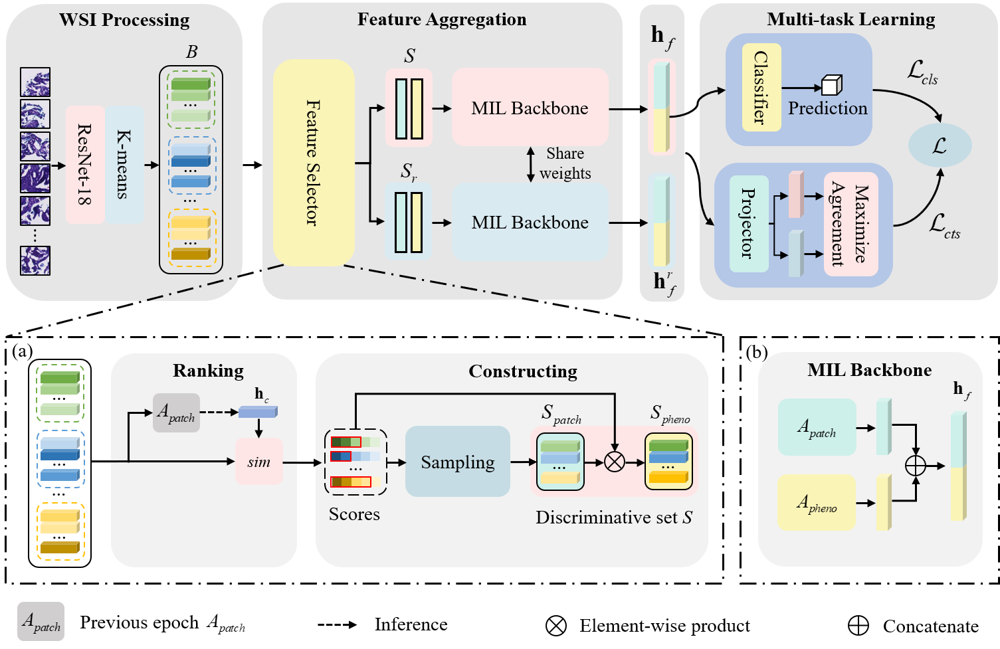

# Clustering-based Multi-instance Learning Network for Whole Slide Image Classification

This repo is the PyTorch implementation for the CBMIL described in the paper "Clustering-based Multi-instance Learning Network for Whole Slide Image Classification".



## Training

```shell
python train.py \
  --dataset CAMELYON16_20x_s256 \
  --data_csv /path/to/data_csv.csv \
  --data_split_json /path/to/data_split.json \
  --num_patches 1024 \
  --preload \
  --optimizer Adam \
  --scheduler CosineAnnealingLR \
  --batch_size 16 \
  --epochs 50 \
  --lr 0.0001 \
  --wdecay 0.0001 \
  --warmup 0 \
  --arch CBMIL \
  --alpha 0.8 \
  --temperature 1 \
  --num_classes 2 \
  --cl_weight 0.1 \
  --device 3 \
  --exist_ok \
  --save_model
```

## Visualization

### heatmaps

```shell
python create_heatmaps.py
```

### clusters  heatmap

```shell
python visualize_clusters_heatmaps.py
```


